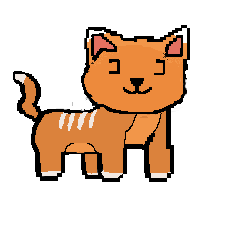

# Workin-title
A maze game called [WORKIN' TITLE]. Made for ACIT-2515 as a final project.

# Project Structure
Models:
    \nmaze: read and store the maze map
    \nplayer: contains the backpack which stores the items collected
Views:
    \nmaze_view: display the maze map and tiles (player, items, exit)
Controllers:
    \nmaze_controller: main controller contains logic of the game
    \nmazeGame: setup required objects and calls controller to run the game

# Dependencies
pygame==2.0.0
These can also be installed using the requirements.txt file provided.

# How to run
The maze game can be easily run by running the main.py program.
In the maze directory, use:
`python main.py`

The webserver can be run by running the `server.py` file in the web directory.

# How to control
User can control the momvent of the player by using either arrow keys or WASD keys. 
By holding down a key, the player will move once every second.
By tapping a key, the player will move each press.

The goal is to collect all 4 items in the maze.

# AOB (Any Other Business)
User is not able to go outside of the grid.
User is required to collect all 4 items and then arrives the exit.
